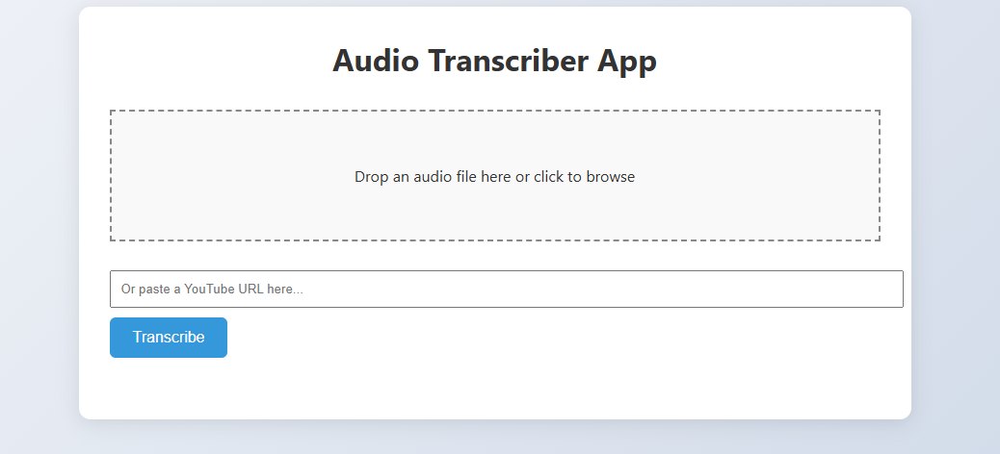

# 🧠 AI Audio Transcriber 🎙️

A Python + FastAPI web app that transcribes audio recordings using OpenAI Whisper. Supports multilingual transcription (including English and Hindi) and provides a beautiful web interface to upload and view results.

---

## 🚀 Features

- ✅ Upload audio recordings (MP3, WAV, etc.)
- ✅ Transcribes audio using [Whisper](https://github.com/openai/whisper)
- ✅ Supports English, Hindi & other languages
- ✅ Clean, responsive UI with multi-line output
- ✅ Dockerized for easy deployment
- ✅ GitHub Actions CI to auto-publish Docker image

---

## 🖼️ Demo UI



---

## 🛠️ Tech Stack

- **Backend:** FastAPI, Whisper
- **Frontend:** HTML + CSS (Jinja2 templating)
- **Container:** Docker
- **CI/CD:** GitHub Actions

---

## 📦 Installation (Local)

### 1. Clone the repo

```bash
git clone https://github.com/your-username/audio-transcriber-app.git
cd audio-transcriber-app
```

### 2. Install dependencies

```bash
pip install -r requirements.txt
```

### 3. Run the app

```bash
uvicorn app.main:app --reload
```

Open in browser: [http://localhost:8000](http://localhost:8000)

---

## 🐳 Docker Setup

### Build & Run

```bash
docker build -t audio-transcriber .
docker run -p 8000:8000 audio-transcriber
```

> Visit: [http://localhost:8000](http://localhost:8000)

---

## 📡 GitHub Action – Docker Publish

This project includes a GitHub Action that automatically:
- Builds the Docker image
- Pushes it to **GitHub Container Registry (GHCR)** on every `main` push

Image will be available at:

```
ghcr.io/<your-username>/audio-transcriber-app:latest
```

---

## 📱 Android Client (Coming Soon)

An Android app is in development to let users record or select audio and get transcriptions directly on their phones.

---

## 📁 File Structure

```
.
├── app/
│   ├── main.py         # FastAPI entrypoint
│   └── utils.py        # Whisper transcription logic
├── templates/
│   └── index.html      # UI frontend
├── uploads/            # Uploaded audio (gitignored)
├── Dockerfile
├── .gitignore
├── requirements.txt
└── README.md
```

---

## 🤝 Contributing

Pull requests welcome! For major changes, please open an issue first to discuss what you'd like to change.

---

## 📄 License

MIT License

---

## 🙌 Credits

- [OpenAI Whisper](https://github.com/openai/whisper)
- [FastAPI](https://fastapi.tiangolo.com/)
- [GitHub Actions](https://docs.github.com/en/actions)
```

---

Let me know if you'd like to:
- Add badges (build passing, license, Docker pull count, etc.)
- Add instructions for deploying on Render / Railway / EC2
- Include the Android app once it's ready

Would you like me to auto-generate a `.gitkeep`, `.gitignore`, `Dockerfile`, or `requirements.txt` too?